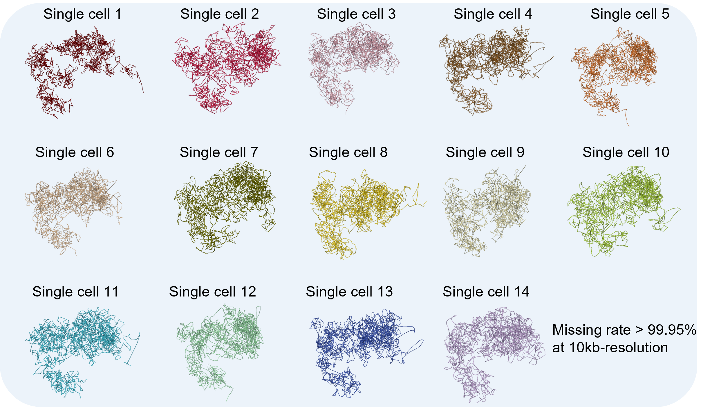

# Tensor-FLAMINGO: **Tensor**-based **F**ast **L**ow-r**A**nk **M**atrix completion algorithm for reconstruct**IN**g high-resolution 3D **G**enome **O**rganizations
## Gallery
**The 3D structures of chromosome 21 for 14 single cells in 10-kb resolution** based on Dip-C data (GM12878).


## Summary
Tensor-FLAMINGO aims to accurately reconstruct the 3D chromatin structures for every single cell from super sparse scHi-C contact maps (missing rate > 99.95%). Remarkably, the tensor-completion-based method borrows information across single cells, while preserving the unique structural variations across single cells.

## Introduction
Tensor-FLAMINGO takes scHi-C data of tens to hundreds of single cells as inputs and reconstructs the single-cell 3D chromatin structures. Tensor-FLAMINGO has two major steps. In the first step, the contact maps of all single cells are modeled as a sparse tensor and then completed using the low-rank tensor completion method. This step gives a dense tensor and imputes the missing values of the original scHi-C data. In the second step, the 3D genome structures are reconstructed for each single cell from the completed chromatin contact map using [FLAMINGO](https://github.com/wangjr03/FLAMINGO/).

## Dependencies
The implementation of the algorithm is based on `python/3.8.2` and `R/3.5.1`.

### R packages
`FLAMINGOr` and `GenomicFeatures` 

```
install.packages("devtools")
library(devtools)
install_github('wangjr03/FLAMINGO/FLAMINGOr',ref='HEAD')

if (!require("BiocManager", quietly = TRUE))
    install.packages("BiocManager")

BiocManager::install("GenomicFeatures")
```


### python packages
`pyfftw`, `scipy`, `numpy`, `pandas`, `joblib` and `ray`.

```
pip install -r requirements.txt
```

## Installation of Tensor-FLAMINGO
The code for the first step is available in the Github: <br>
```
git clone https://github.com/wangjr03/Tensor-FLAMINGO.git
cd Tensor-FLAMINGO/src
ls
```
The R package for Tensor-FLAMINGO (*tFLAMINGOr*) can be installed through Github using *devtools*:<br>
```
install.packages("devtools")
library(devtools)
install_github('wangjr03/Tensor-FLAMINGO/tFLAMINGOr')
```
## Input data
The standard sparse-matrix format scHi-C data is accepted
```
chr1 12345 chr1 13456
```

## **UPDATE** One command line to run Tensor FLAMINGO

Usage
```
bash tflamingo_main.sh --code_dir <CODE_DIR> --data_path <DATA_PATH> --output_dir <OUTPUT_DIR> --chr_name <CHR_NAME> --assembly <ASSEMBLY> --low_resolution <LOW_RESOLUTION> --high_resolution <HIGH_RESOLUTION>
```

Example
```
bash tflamingo_main.sh --code_dir "./Tensor-FLAMINGO/" --data_path "./data/" --output_dir "./output/" --chr_name "chr19" --assembly "mm10" --low_resolution 10000 --high_resolution 300000
```

## Example of reconstructing the 3D genome structure with Tensor-FLAMINGO and tFLAMINGOr
Here we shown an example of reconstructing the single-cell 3D chromosome structures in 10kb resolution. Supposing the scHi-C data for all single cells are stored at `./data`, the following code preprocesses the data.
```
library(tFLAMINGOr)
# first generate contact maps at low-resolution (300kb)
tflamingo.generate_matrix(input_path='./data', resolution=300000, opt_path='./300kb_contact_maps',assembly='mm10')

# then generate contact maps at high-resolution (10kb)
tflamingo.generate_matrix(input_path='./data', resolution=10000, opt_path='./10kb_contact_maps',assembly='mm10')

# Transform scHi-C data (300kb)
tflamingo.linear_transformation(chr_name='chr19',resolution=300000,input_path='./300kb_contact_maps',  opt_path='./300kb_contact_maps_transformed',assembly='mm10')

# Transform scHi-C data (10kb)
tflamingo.linear_transformation(chr_name='chr19',resolution=1000,input_path='./10kb_contact_maps',  opt_path='./10kb_contact_maps_transformed',assembly='mm10')
```
Applies tensor-completion method
```
python src/Paralized_Low_rank_tensor_completion_FFTW.py -i './300kb_contact_maps_transformed' -o './LRTC_300kb_contact_maps' -s 300kb -max_iter 150 -n_core 10
python src/Paralized_Low_rank_tensor_completion_FFTW.py -i './10kb_contact_maps_transformed' -o './LRTC_10kb_contact_maps' -s 10kb -max_iter 150 -n_core 10
python src/Extract_matrix_from_LRTC.py -i './LRTC_300kb_contact_maps/300kb.npy' -o './300kb_contact_maps_FLAMINGO'
python src/Extract_matrix_from_LRTC.py -i './LRTC_10kb_contact_maps/10kb.npy' -o './10kb_contact_maps_FLAMINGO'
```
Reconstruct the 3D chromatin structures:
```
library(tFLAMINGOr)
n = length(dir('./10kb_contact_maps_FLAMINGO') )
res_list <- list()
for(idx in 1:n){
  input_PD_high = paste0('./10kb_contact_maps_FLAMINGO/PD_Cell_',idx,'.txt')
  input_IF_high=paste0('./10kb_contact_maps_FLAMINGO/IF_Cell_',idx,'.txt')
  input_PD_low=paste0('./300kb_contact_maps_FLAMINGO/PD_Cell_',idx,'.txt')
  input_IF_low=paste0('./300kb_contact_maps_FLAMINGO/IF_Cell_',idx,'.txt')
  res_list[[i]] <- tflamingo.main_func(
         input_PD_high=input_PD_high,
         input_IF_high=input_IF_high,
         input_PD_low=input_PD_low,
         input_IF_low=input_IF_low,
         domain_res = 300000,
         frag_res = 10000,
         chr_name='chr19',
         downsampling_rates=0.75,
         lambda=10,
         max_dist=0.05,
         nThread=20,
         max_iter=500
  )
}
```
### output data format
For each single cell, a data frame with four columns containing the fragment id (the first column) and the 3D coordinates (the other three columns) will be generated.

### visualize the 3D genome structure using ParaView
Similar to FLAMINGO, Tensor-FLAMINGO predictions can also be visualized using ParaView. To visualize the 3D genome structure using FLAMINGO, the user need to convert the 3D coordinates into a *.vtk* file. In the **FLAMINGOr** package, a `write.vtk` function is provided for such conversion using the command below:<br>
```
write.vtk(points=res[,-1],lookup_table=rep(1,dim(res)[1]),name='chr1 5kb 3D structure',opt_path='./chr1_5kb.vtk')
```
*Arguments*:<br>

*points*: 3D coordinates predicted by FLAMINGO in the x,y,z format. <br>

*lookup_table*: The annotation of each point, could be labels or scores, i.e. the compartment PC scores.<br>

*name*: output file name annotated within the file.<br>

*opt_path*: output file path including the file name. <br>
